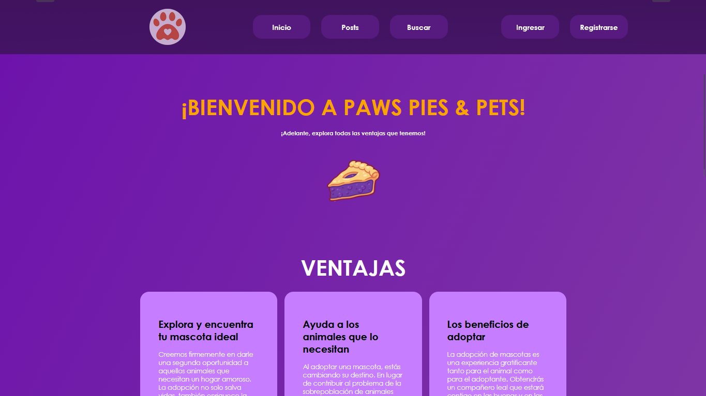
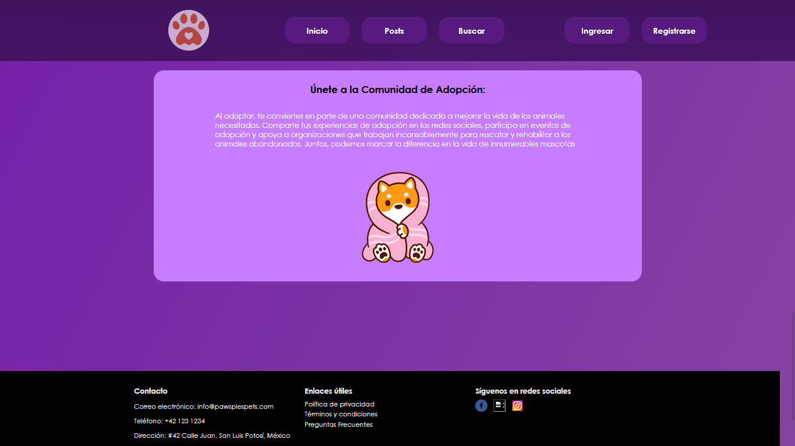

# 🐶 Paws Pies & Pets — Pet Adoption Application

## Description
Paws Pies & Pets is a web application for posting, searching, and adopting pets.  
It allows users to create posts with pets available for adoption, search using filters, view profiles, and contact advertisers.  
The app combines a **PHP backend** with a **MySQL database** and a **frontend built with HTML/CSS/JS**.

---

## Key Features
- Basic user authentication (login/register).
- Create, edit, and delete pet posts (title, description, image, contact info).
- Home page with a carousel and featured pets.
- Pet search and results page.
- User profiles and personal pages (profile, personal profile).
- Basic messaging/chat system (`get_messages.php`, `set_messages.php`, `verChats.php`).
- Administration panel (`administrar.php`) for basic management.

---

### Screenshot 1


### Screenshot 2


---

## Project Structure
- `index.php` — Main page with the carousel and pet listings.  
- `html/` — Main PHP pages (login, register, posts, createpost, editpost, profile, chat, etc.).  
- `js/` — Client-side scripts: `carrusel.js`, `menudes.js`, `login.js`, `funcion.js`, `cerrarsesion.js`.  
- `css/` — Application styles.  
- `img/` — Images used in the app (logo, pets, backgrounds).  
- `Base de datos/` — Database initialization SQL: `pawspiespets.sql`.

---

## Requirements
- PHP 7.2+ (or equivalent installed on Windows).  
- Web server (Apache/IIS) or use PHP’s built-in development server.  
- MySQL or MariaDB.  
- Modern web browser.

---

## Installation & Setup (Development)
1. Clone or copy the project to your local machine.  
2. Import the database using the SQL file located in `Base de datos/pawspiespets.sql`  
   (for example, via phpMyAdmin or the `mysql` command-line tool):

   ```powershell
   # Example using mysql from PowerShell
   mysql -u your_user -p your_database < "Base de datos\pawspiespets.sql"
3. Adjust the database connection details in html/conexion.php (user, password, host, database name).
Make sure to secure credentials in production environments.

4. Start a local server from the project root (quick option using PHP’s built-in server):

From the project root
php -S localhost:8000

Then open http://localhost:8000

---
## Quick Usage Guide

- Register (or create a user) and log in with those credentials.
- Go to “Create Post” to publish a pet available for adoption.
- Use the search feature to filter pets (based on buscar.php implementation).
- Check chats and messages in verChats.php / chat.php.

---
## Technical Notes & Key Files

- html/CAD.php — Contains the data access logic (services) interacting with the database.
- html/conexion.php — MySQL connection configuration.
- js/carrusel.js — Controls the image carousel on the main page.
- js/menudes.js — Handles the opening/closing of the responsive menu.
- index.php — Renders the homepage and loads posts from CAD.